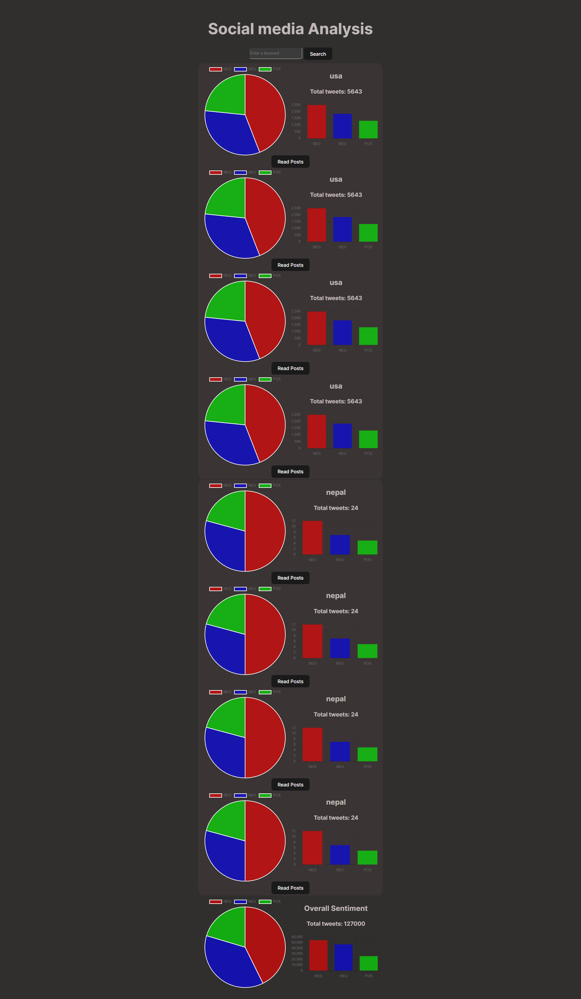

# Tweeter analysis

Demo Video 
https://youtu.be/5lwiuEWD7ko



An easy to use app to visualize what people are talking on socialn  media during an occassion eg Olypic.

## Features to be added:

- see visualizations according to the locations of audiences
- feature to let use specify the type of sentiment and number of tweets to read the tweets

## Usage

1. clone the repo
2. To run the backed

```
pip3 install -r requirements.txt
cd backend
uvicorn main:app --reload

```
3. To run the frontend
```
npm install react
cd frontend
npm run dev
```

